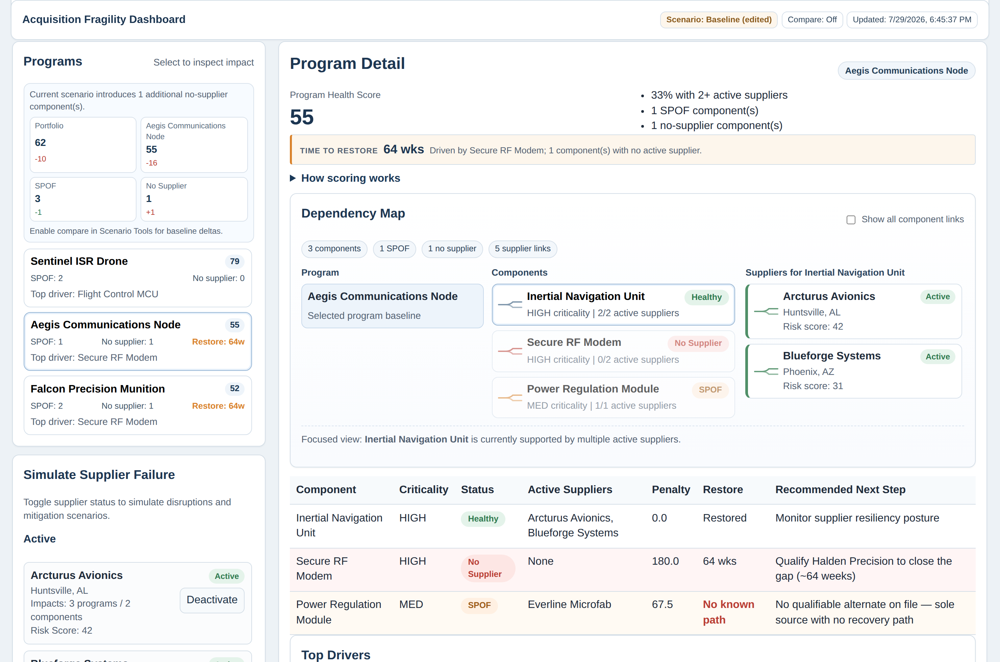

# Acquisition Fragility Dashboard

**[Live demo →](https://mattvildibill.github.io/acquisition-fragility-dashboard/)**

A small tool for one question: **if a supplier goes down, which programs stop, and how long are they stopped for?**

Supplier risk usually lives in a spreadsheet — a list of vendors with a risk score next to each. That tells you a vendor looks shaky. It doesn't tell you that the shaky vendor is the only qualified source for a part that three programs depend on, or that the nearest alternate is 64 weeks of qualification away. This models the dependency graph so you can ask the second question.



## Try it

```bash
npm install
npm run dev
```

The 30-second version, using the seeded demo data:

1. **Baseline.** Portfolio health sits at 72 and no program is below the 60 at-risk line. Risk Overview flags the Secure RF Modem as sole-sourced to Cobalt Dynamics — which is adversary-linked.
2. **Deactivate Cobalt Dynamics** in the supplier panel on the left.
3. Two programs fall below the line: Aegis Communications Node 71 → 55, Falcon Precision Munition 65 → 52. The Secure RF Modem now has no active supplier at all.
4. **Select Aegis.** The restore banner reads **64 weeks** — the only qualified alternate on file is a Norwegian supplier, and that's the qualification lead time.

A vendor risk list would have shown Cobalt Dynamics at 58/100 and stopped there. The 64 weeks is the number that actually changes what you do about it.

## What it models

Three entity types and two link tables, kept as an explicit graph rather than a flattened join:

```
Program  --requires-->  Component  --sourced from-->  Supplier
```

Each component gets a status from how many of its suppliers are currently producing:

| Active suppliers | Status | Meaning |
| --- | --- | --- |
| 2+ | Healthy | Has redundancy |
| 1 | SPOF | Delivering, but one failure from a gap |
| 0 | No supplier | Capability gap — the line stops |

**Qualification lead time** lives on the component–supplier link, not on the supplier. Qualification is per-part: the same vendor can be a drop-in for one board and an 18-month first-article effort for another. That's what makes a restore estimate possible.

**Ownership exposure** (domestic / allied / adversary-linked) is tracked but deliberately kept *out* of the health score. See below.

## The score

Each program starts at 100 and loses weighted penalties:

- SPOF component: `45 × criticality weight`
- No supplier: `90 × criticality weight`
- Criticality weights: LOW 1.0, MED 1.5, HIGH 2.0
- Total penalty is normalised by the program's total criticality weight, so a 4-component program and a 12-component program are comparable

Every number on screen traces back to a specific component and a specific supplier. There's no fitted model here, which is the point — in a review, "why did this drop 16 points" needs an answer you can say out loud.

### Two design calls worth explaining

**Restore time only counts components at zero active suppliers.** My first version included SPOFs, and the headline number never moved — almost everything is a SPOF at baseline, so the estimate was pinned to the worst qualification lead time in the dataset no matter what you did. A SPOF is fragile but still delivering. A gap is what stops a line.

**Ownership exposure is not in the score.** It's tempting to add a penalty and get one number. But second-sourcing fixes availability and does nothing about who owns the vendor — they're different problems with different remedies and different timelines. Rolling them together produces a score that goes down for two unrelated reasons and tells you nothing about which lever to pull. Adversary-linked sole sources get their own counter instead.

## What's wrong with it

Being specific, because most of this is load-bearing if anyone tried to use it:

- **The score floor is 10, not 0.** Penalties are normalised by total weight and the worst per-component penalty is 90, so a program with every component stranded scores 10. There's a test pinning this. A real version should rescale.
- **The constants are invented.** 45, 90, and the 1.0/1.5/2.0 weights are my judgement, not calibration. They produce sensible orderings on this dataset; I have no evidence they're right in general. The 2× weight on blast radius in the critical-node ranking is the same story.
- **Supplier state is binary.** Real disruption is partial and time-phased — reduced capacity, allocation, a six-month lead time stretch. On/off is a coarse approximation, and it means the tool can't represent the most common real case.
- **No sub-tier visibility.** Every real single point of failure I've read about lives two or three tiers down, at a foundry or a specialty alloy mill that no prime has on a diagram. This models tier one only, which is the easy part.
- **Restore assumes gaps close in parallel** and that qualification is the only constraint. No engineering capacity, no tooling, no funding line.
- **Ownership exposure is an enum someone typed into a JSON file.** The real version of that field is an entity-resolution problem over corporate hierarchies, and it's harder than everything else here combined.
- **Scenarios are localStorage only.** Share links encode state in the URL, which works but breaks if the dataset changes underneath.

## If it had real data

The model is the easy half. What would make it useful is the ingest: contract and obligation history to find who actually delivers a part, corporate hierarchy resolution for the ownership question, and sub-tier discovery to get past tier one. Qualification lead times would come from program offices rather than from me making them up.

The scoring engine is deliberately isolated in `src/lib/scoring.ts` with the dataset behind a single import, so swapping the static JSON for an API is a small change. That was the one piece of architecture I bothered with.

## Tests

```bash
npm test
```

31 tests over the scoring engine and the share-link encoding. A few run against the demo dataset specifically to keep the walkthrough above honest — if I change a supplier and the numbers in this README go stale, those fail.

Writing them turned up two real bugs: a supplier knocked offline by a scenario was being recommended as its own replacement, and the "top critical supplier" callout could name a different vendor than the top row of the table right below it. Both are fixed; both have tests.

The React components aren't covered. For a project this size, a DOM test environment to assert on markup that changes every time I move a panel wasn't worth the maintenance.

## Stack

React, TypeScript, Vite. No component library, no state management library, no backend — the whole thing is a static build.

```
src/lib/scoring.ts     scoring engine, no React imports
src/data/              types and the seeded dataset
src/components/        presentational pieces
src/pages/             the two main panels
```

## Data

Everything in `src/data/dataset.json` is synthetic. Program names, suppliers, and lead times are invented to exercise the model — three programs, six components, seven suppliers, with a couple of scenarios worth clicking through. Nothing here is derived from real programs or real vendors.
